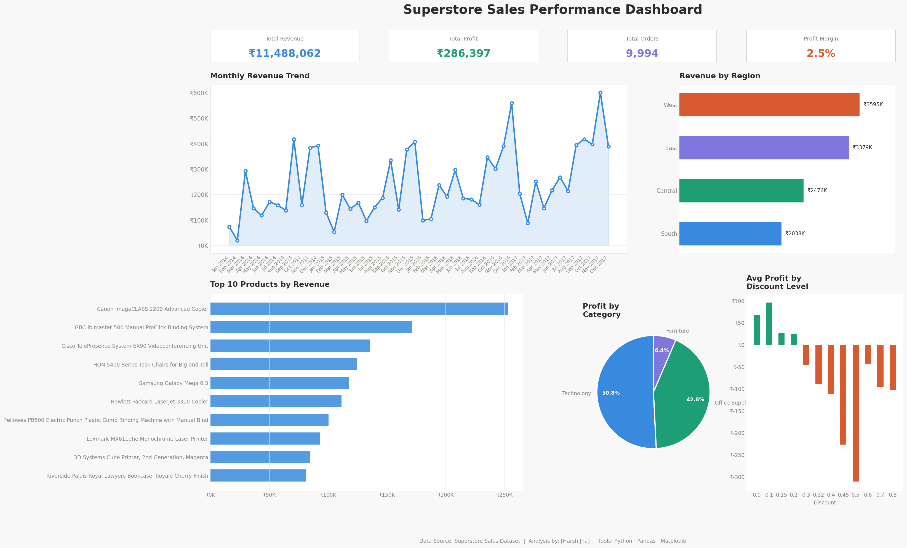

# Sales Performance Dashboard

Analyzed 10,000+ sales records using Python and Pandas. Built a 5-chart dashboard revealing regional revenue, monthly trends, top products, and discount impact on profitability.

## Tools Used
- Python, Pandas, Matplotlib

## Dashboard Preview

## Key Findings
- West region contributed the highest revenue
- Higher discounts directly reduced profit margins
- Technology category had the highest profitability
